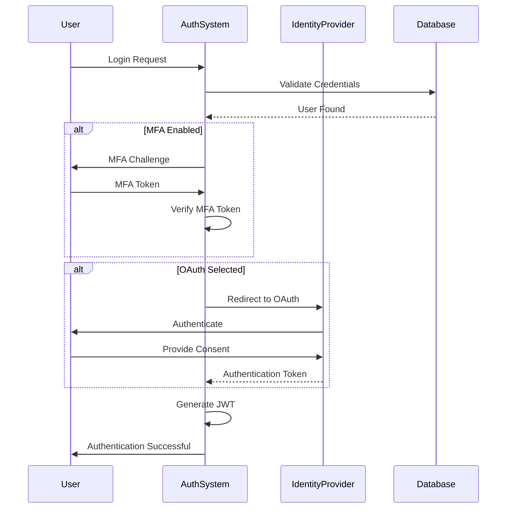

# Comprehensive Authentication Project Structure

## Project Directory Layout

```
authentication-system/
│
├── config/
│   ├── database.go
│   ├── environment.go
│   └── security.go
│
├── internal/
│   ├── auth/
│   │   ├── jwt.go
│   │   ├── mfa.go
│   │   ├── oauth.go
│   │   ├── passwordless.go
│   │   └── biometric.go
│   │
│   ├── models/
│   │   ├── user.go
│   │   ├── token.go
│   │   └── authentication.go
│   │
│   ├── repository/
│   │   ├── user_repository.go
│   │   ├── token_repository.go
│   │   └── authentication_repository.go
│   │
│   └── services/
│       ├── authentication_service.go
│       ├── user_service.go
│       └── token_service.go
│
├── pkg/
│   ├── middleware/
│   │   ├── authentication.go
│   │   ├── authorization.go
│   │   └── logging.go
│   │
│   └── utils/
│       ├── encryption.go
│       ├── validation.go
│       └── random.go
│
├── scripts/
│   ├── database_migration.sql
│   ├── setup_dev_environment.sh
│   └── generate_certificates.sh
│
├── api/
│   ├── handlers/
│   │   ├── auth_handler.go
│   │   ├── user_handler.go
│   │   └── mfa_handler.go
│   │
│   └── routes/
│       ├── auth_routes.go
│       ├── user_routes.go
│       └── middleware_routes.go
│
├── web/
│   ├── static/
│   │   ├── css/
│   │   ├── js/
│   │   └── images/
│   │
│   └── templates/
│       ├── login.html
│       ├── register.html
│       └── mfa_setup.html
│
├── tests/
│   ├── unit/
│   │   ├── auth_test.go
│   │   └── user_test.go
│   │
│   └── integration/
│       ├── authentication_flow_test.go
│       └── api_integration_test.go
│
├── docs/
│   ├── api_specification.yaml
│   ├── authentication_flow.md
│   └── security_guidelines.md
│
├── deployments/
│   ├── docker-compose.yml
│   ├── Dockerfile
│   └── kubernetes/
│       ├── deployment.yml
│       └── service.yml
│
├── go.mod
├── go.sum
├── main.go
└── README.md
```

## Authentication Implementation Example

### 1. Configuration Management (config/security.go)

```go
package config

type SecurityConfig struct {
    JWTSecret       string
    TokenExpiration time.Duration
    MFAEnabled      bool
    OAuthProviders  map[string]OAuthProvider
}

type OAuthProvider struct {
    ClientID     string
    ClientSecret string
    RedirectURL  string
}

func LoadSecurityConfig() *SecurityConfig {
    return &SecurityConfig{
        JWTSecret:       os.Getenv("JWT_SECRET"),
        TokenExpiration: 24 * time.Hour,
        MFAEnabled:      true,
        OAuthProviders: map[string]OAuthProvider{
            "google": {
                ClientID:     os.Getenv("GOOGLE_CLIENT_ID"),
                ClientSecret: os.Getenv("GOOGLE_CLIENT_SECRET"),
                RedirectURL:  "http://localhost:8080/oauth/callback",
            },
        },
    }
}
```

### 2. Authentication Service (internal/services/authentication_service.go)

```go
package services

type AuthenticationService struct {
    userRepo     repository.UserRepository
    tokenService *TokenService
    config       *config.SecurityConfig
}

func (s *AuthenticationService) Authenticate(username, password string) (string, error) {
    user, err := s.userRepo.FindByUsername(username)
    if err != nil {
        return "", ErrUserNotFound
    }

    if !s.verifyPassword(user, password) {
        return "", ErrInvalidCredentials
    }

    // Generate JWT token
    token, err := s.tokenService.GenerateToken(user)
    if err != nil {
        return "", ErrTokenGeneration
    }

    // Optional: Check if MFA is required
    if s.config.MFAEnabled && user.MFARequired {
        // Initiate MFA challenge
        return s.initiateMFAChallenge(user)
    }

    return token, nil
}
```

### 3. MFA Handler (api/handlers/mfa_handler.go)

```go
package handlers

type MFAHandler struct {
    authService *services.AuthenticationService
}

func (h *MFAHandler) SetupMFA(w http.ResponseWriter, r *http.Request) {
    user := getCurrentUser(r)

    // Generate MFA secret
    secret, qrCode, err := h.authService.GenerateMFASecret(user)
    if err != nil {
        http.Error(w, "MFA Setup Failed", http.StatusInternalServerError)
        return
    }

    // Send QR code to user for scanning
    renderTemplate(w, "mfa_setup", map[string]interface{}{
        "QRCode": qrCode,
        "Secret": secret,
    })
}

func (h *MFAHandler) VerifyMFA(w http.ResponseWriter, r *http.Request) {
    token := r.FormValue("token")
    user := getCurrentUser(r)

    if h.authService.VerifyMFAToken(user, token) {
        // Generate final authentication token
        authToken, err := h.authService.GenerateAuthToken(user)
        if err != nil {
            http.Error(w, "Authentication Failed", http.StatusUnauthorized)
            return
        }

        // Set authentication cookie
        http.SetCookie(w, &http.Cookie{
            Name:     "auth_token",
            Value:    authToken,
            HttpOnly: true,
            Secure:   true,
        })

        http.Redirect(w, r, "/dashboard", http.StatusSeeOther)
    } else {
        http.Error(w, "Invalid MFA Token", http.StatusUnauthorized)
    }
}
```

## Authentication Flow Diagram (Mermaid)

website diagram: [https://www.mermaidchart.com/app/projects/f38c541d-99a5-4d0e-932f-fcb560cc6ad2/diagrams/19ba5840-7821-464f-9268-4b94c55f7d21/version/v0.1/edit](https://www.mermaidchart.com/app/projects/f38c541d-99a5-4d0e-932f-fcb560cc6ad2/diagrams/19ba5840-7821-464f-9268-4b94c55f7d21/version/v0.1/edit)



## Security Best Practices Integration

1. Use environment-based configuration management
2. Implement robust error handling
3. Use secure, randomly generated tokens
4. Implement rate limiting
5. Log authentication attempts
6. Use HTTPS and secure cookie settings
7. Implement token rotation and revocation

## Deployment Considerations

- Use Docker for containerization
- Implement Kubernetes deployment strategies
- Use secrets management (e.g., HashiCorp Vault)
- Implement CI/CD pipelines
- Set up monitoring and logging

## Recommended Dependencies

- Authentication:
  - `github.com/golang-jwt/jwt`
  - `github.com/markbates/goth` (OAuth)
- Security:
  - `golang.org/x/crypto`
  - `github.com/securecookie`
- Validation:
  - `github.com/go-playground/validator`

## Conclusion

This comprehensive project structure provides a robust, scalable, and secure authentication system that can be easily extended and customized for various requirements.
