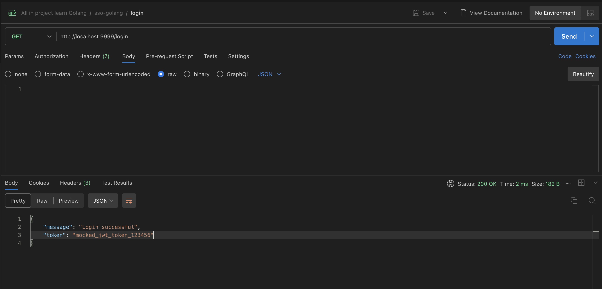
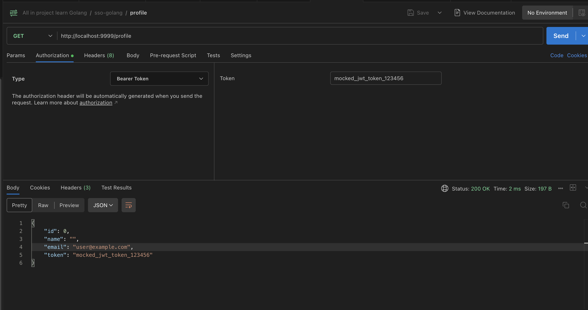

# Intro

đây là một dự án Golang sử dụng **SSO (Single Sign-On)** với **OAuth2** . Hệ thống này bao gồm:

- **Backend (Golang + Gin Framework)** : Xử lý đăng nhập và xác thực token.
- **SSO Provider (Mocked)** : Giả lập một hệ thống SSO cấp phát token.

Dự án này sẽ có:

1. **Endpoint `/login`** : Chuyển hướng đến SSO để đăng nhập.
2. **Endpoint `/callback`** : Nhận token từ SSO sau khi xác thực.
3. **Endpoint `/profile`** : Lấy thông tin user bằng token.

```
so-golang/
├── main.go
├── config/
│ └── config.go
├── handlers/
│ └── auth.go
├── middleware/
│ └── auth_middleware.go
├── utils/
│ └── http_client.go
├── go.mod
└── go.sum
```

## Run project

`go run .`

## API

- api login



- api profile


